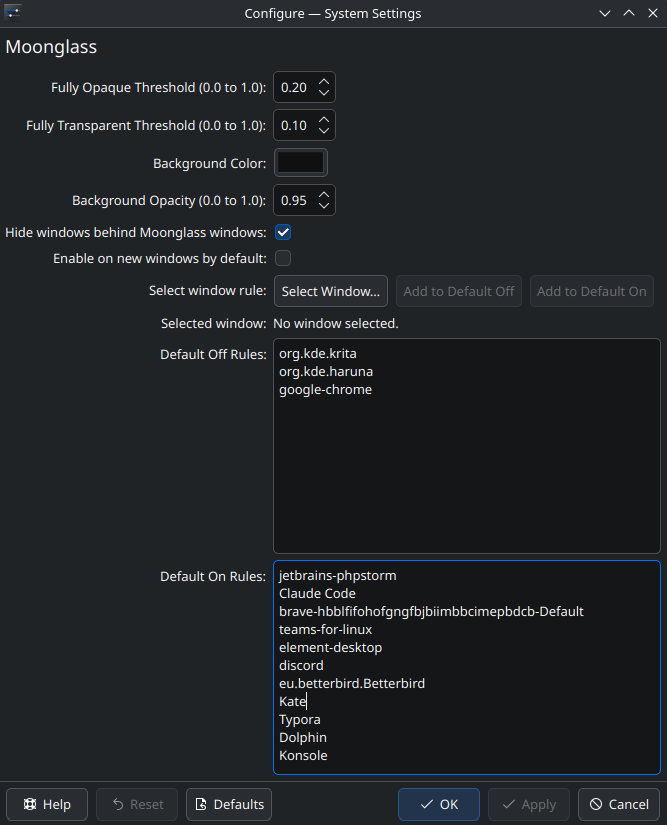

# Moonglass

**Brightness-keyed window transparency for the KDE Plasma desktop on Linux.**

https://github.com/user-attachments/assets/3be3078f-1b64-4cc7-a8fa-25fd0c982804

<!-- Fallback if the video above stops rendering:  -->

Moonglass is a desktop effect for KDE Plasma (Linux) that fades each window
pixel by its brightness: dark pixels become transparent, bright pixels (text,
UI accents) stay opaque. The result is a window whose background dissolves into
the desktop while its content keeps floating, readable, on top.

Unlike ordinary terminal/window transparency — which dims the *whole* window by
a uniform alpha — Moonglass keys on per-pixel luminance, so a dark terminal
shows only its text, not a translucent gray slab. It also clips the windows
behind a Moonglass window so you see the desktop through the transparent areas,
not a soup of overlapping app windows.

## Features

- Per-pixel luminance keying via a custom GLSL shader (real source-over alpha,
  not additive blending).
- Configurable opaque / transparent brightness thresholds with a linear fade
  between them.
- Optional solid background layer (color + opacity) behind faded pixels.
- Overlap clipping so transparent areas reveal the desktop, not lower windows.
- Per-window toggle (default **Meta+Z**).
- Optional auto-apply to new windows, with per-app default-on / default-off
  rules and an interactive "pick a window" rule helper.
- Color-management correct: routes through KWin's own brightness / saturation /
  HDR / ICC shader helpers, so Moonglass windows match normal ones.

## Requirements

- **KDE Plasma 6** (its KWin 6 compositor) on **Wayland**. (Plasma 5 is not
  supported — the effect API differs.)
- An OpenGL compositing backend.
- To build: a current KWin 6 plus its `kwin-dev` / `kwin-devel` headers — the
  effect API changes between KWin releases, so an old 6.x may not compile.

## Installing

Moonglass is a compiled KWin effect with **no stable ABI** — a binary only
loads on the exact KWin it was built for, and the effect API itself changes
between KWin releases. So for now it installs **by building from source**
against your own KWin. (Prebuilt per-distro binaries aren't available yet — see
[Prebuilt binaries](#prebuilt-binaries).)

### Quick install (builds from source)

```sh
curl -fsSL https://raw.githubusercontent.com/eric-frost/moonglass/main/install.sh | sh
```

The script detects your distro and KWin, uses a matching prebuilt release asset
if one exists (none yet), and otherwise builds from source. You need a Plasma 6
/ KWin 6 **development** environment — it reports any missing packages.

### From source (manual)

Needs the KWin and KF6 development packages (see
[`.github/workflows/build.yml`](.github/workflows/build.yml) for the exact
package names per distro).

```sh
cmake -B build -S . -DCMAKE_INSTALL_PREFIX=/usr
cmake --build build -j
sudo cmake --install build
qdbus6 org.kde.KWin /KWin org.kde.KWin.replace   # reload compositor
```

After a KWin update the binary may become unsupported — rebuild and reinstall
(just re-run the quick-install one-liner).

### Uninstall

```sh
curl -fsSL https://raw.githubusercontent.com/eric-frost/moonglass/main/install.sh | sh -s -- --uninstall
```

Or `./install.sh --uninstall` from a checkout. It removes the installed plugin
files and unloads the effect; your Moonglass settings in `kwinrc` are left
untouched. (Packaged installs: use your package manager instead.)

## Using it

- **Meta+Z** toggles Moonglass on the focused window.
- Configure under **System Settings → Window Management → Desktop Effects →
  Moonglass** (the wrench/settings icon): thresholds, background, clipping,
  auto-apply, and per-app rules.



## Prebuilt binaries

Not available yet because KWin checks an effect's API version at load and refuses a mismatch, *and* the source API changes between releases. Moonglass tracks the current KWin effect API, so it needs a recent KWin 6 to build at all, and a prebuilt would have to match your exact distro **and** KWin version to be useful.

Until that's solved, the installer builds from source against whatever KWin you have. Packaged installs (PPA `.deb`, AUR) that pin the KWin version are the longer-term plan.

## License

GPL-3.0-or-later. See [LICENSE](LICENSE).
